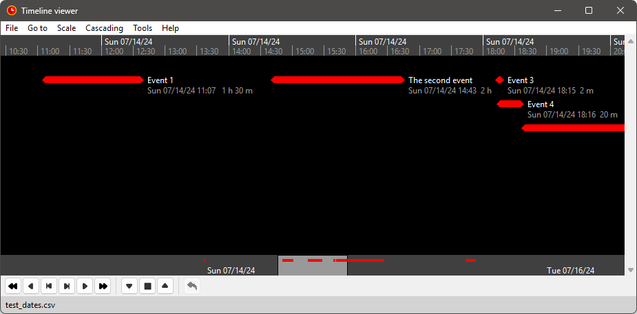
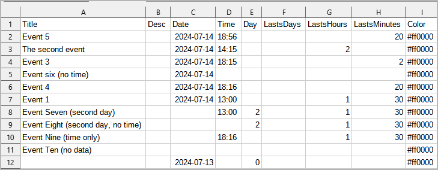

#  timeline-view-tk

A timeline viewer programmed with Python, using tkinter.

The data is read from a csv file:

*Timeline_viewer* is a simple standalone application using the *tlv* class library 
with a menu and a toolbar. 

## Features

- The application reads the timeline data from a csv file and displays it on a resizable 
  window.
- Events can be defined with a specific date or with an unspecific day.
- For the specific date, the Gregorian calendar is used.
  Only positive dates with years between 0001 and 9999 are accepted.
- For the day zero, you can define a reference date, so that events with unspecific dates 
  can be placed on a calendar scale.  
- You can increase and reduce the time scale. 
- You can scroll forward and back in time.
- You can move the events along the time scale using the mouse.
- You can adjust the events' durations using the mouse.
- The application is ready for internationalization with GNU gettext. 

The *tlv* class library is also used for the 
[novelibre timeline viewer plugin](https://github.com/peter88213/nv_tlview/),
and for the 
[yWriter Timeline viewer](https://github.com/peter88213/yw_tlview)
for example.

## Translations

There is a [German language pack](https://codeberg.org/peter88213/tlviewer_de) to be installed separately. 

## Requirements

- Windows or Linux. Mac OS support is experimental.
- [Python](https://www.python.org/) version 3.7+. 

---

- [Changelog](docs/changelog.md)
- [User guide (English)](docs/help/)
- [User guide (German)](https://codeberg.org/peter88213/tlviewer_de/src/branch/main/docs/help)

---

## Download and install

### Default: Executable Python zip archive

Download the latest release [timeline_viewer_v0.10.1.pyzw](https://codeberg.org/peter88213/timeline-view-tk/raw/branch/main/dist/timeline_viewer_v0.10.1.pyzw) (49 KB)

- Launch *timeline_viewer_v0.10.1.pyzw* by double-clicking (Windows desktop),
- or execute `python timeline_viewer_v0.10.1.pyzw` (Windows), resp. `python3 timeline_viewer_v0.10.1.pyzw` (Linux) on the command line.

> [!IMPORTANT]
> Many web browsers recognize the download as an executable file and offer to open it immediately. 
> This starts the installation under Windows.
> 
> However, depending on your security settings, your browser may 
> initially  refuse  to download the executable file. 
> In this case, your confirmation or an additional action is required. 
> If this is not possible, you have the option of downloading 
> the zip file. 

### Alternative: Zip file

The package is also available in zip format: [timeline_viewer_v0.10.1.zip](https://codeberg.org/peter88213/timeline-view-tk/raw/branch/main/dist/timeline_viewer_v0.10.1.zip) (50 KB)

- Extract the *timeline_viewer_v0.10.1* folder from the downloaded zipfile "timeline_viewer_v0.10.1.zip".
- Move into this new folder and launch *setup.pyw* by double-clicking (Windows desktop), 
- or execute `python setup.pyw` (Windows), resp. `python3 setup.pyw` (Linux) on the command line.

---

## Credits

- The logo and the toolbar icons are based on the [Eva Icons](https://akveo.github.io/eva-icons/#/), published under the [MIT License](http://www.opensource.org/licenses/mit-license.php). The original black and white icons were adapted for this application by the maintainer. 

---

## License

This is Open Source software, and *timeline-view-tk* is licensed under GPLv3. See the
[GNU General Public License website](https://www.gnu.org/licenses/gpl-3.0.en.html) for more
details, or consult the [LICENSE](LICENSE) file.

